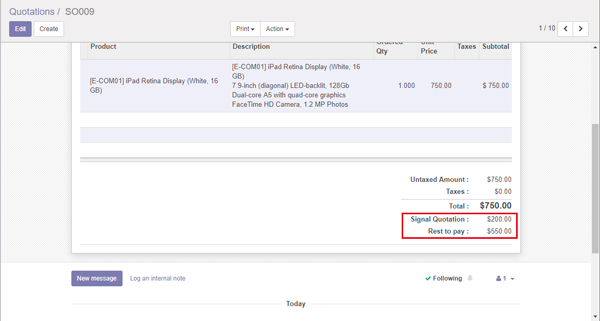
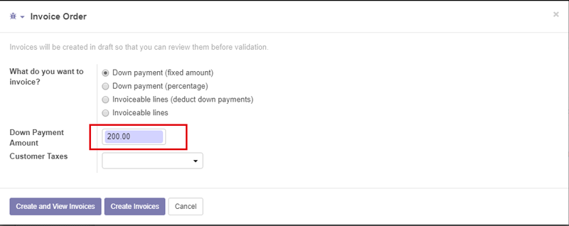
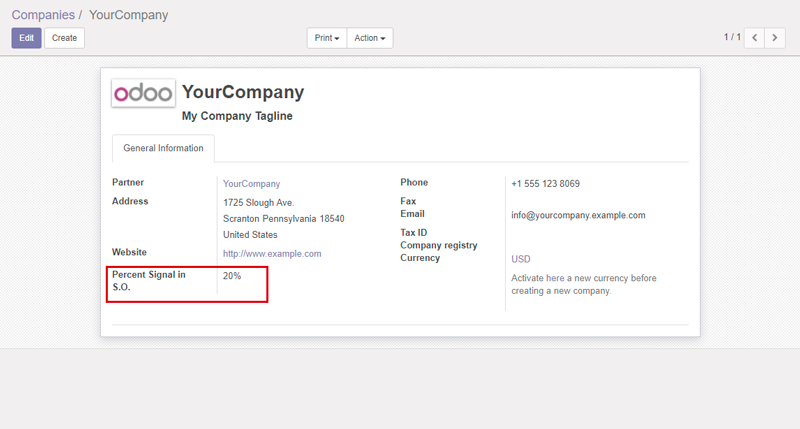

.. image:: https://img.shields.io/badge/licence-AGPL--3-blue.svg
   :target: http://www.gnu.org/licenses/agpl
   :alt: License: AGPL-3

==============
Payment Signal
==============

Module to signal quotations and orders

Usage
=====

This module creates a field to enter the payment signal,
which is automatically calculated by a percentage associated with the company.
These amounts, automatically appear in Invoice Order.

Contributors
------------

* Amaro Pesquero <apesquero@gmail.com>

Do not contact contributors directly about support or help with technical issues.

Maintainer
----------

.. image:: https://odoo-community.org/logo.png
   :alt: Odoo Community Association
   :target: https://odoo-community.org

This module is maintained by the OCA.

OCA, or the Odoo Community Association, is a nonprofit organization whose
mission is to support the collaborative development of Odoo features and
promote its widespread use.

To contribute to this module, please visit https://odoo-community.org.
