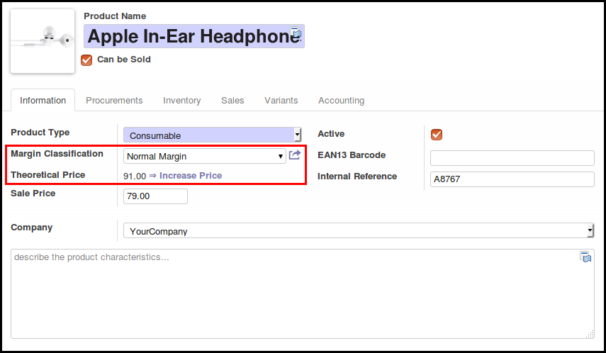
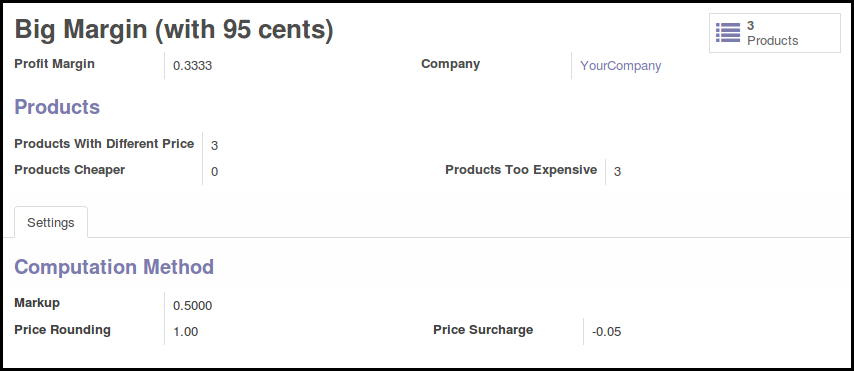
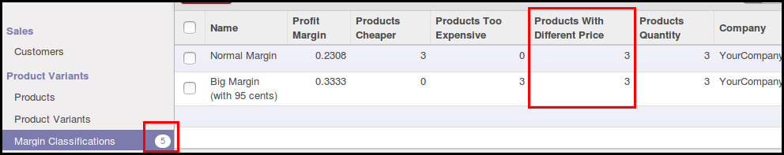

This module is designed to extend Sale Price computation in Odoo.

This module add a new model 'Margin Classifications' linked to Product Templates.

A margin classification has a 'Profit Margin' field and extra fields to manage
computation method, like in Pricelist Item model (Markup Rate, Rounding and Surcharge fields)

If product has a margin classification defined and the theoretical price is
not the same as the sale price, an extra field 'Theoretical Price' is
displayed, based on the Margin Classification and a button is available to
change sale price.

On the Margin classification Form, user can change computation fields.
(Margin, Rounding method, ...) 
Three buttons are available to apply theoretical prices:
* to all products, 
* only for products that are too expensive
* only for products that are too cheap

User can so see easily products with incorrect margins in the tree views, and in the menu:

This module use both [Markup](https://en.wikipedia.org/wiki/Markup_(business))
and [Profit Margin](https://en.wikipedia.org/wiki/Profit_margin) concepts.

You could be interested by native Pricelist functionalities, setting sale
prices based on Cost prices. The main problem of this design is that sale price
change automaticaly when cost price changes, that is not desired in some user
cases. For exemple, if you have a shop, you want to changes sale prices when
customers is not in the shop, and after having changed labels in the shop.