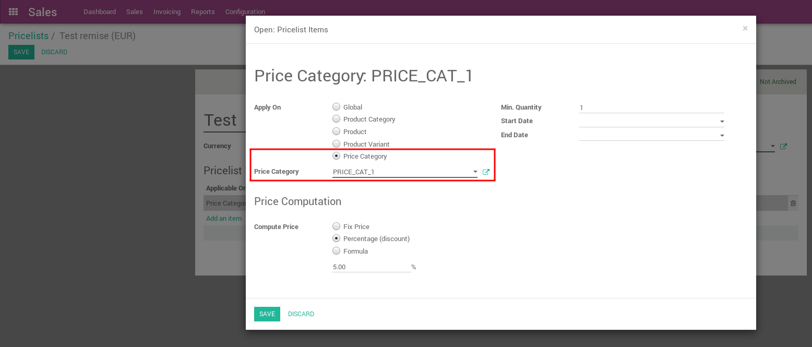
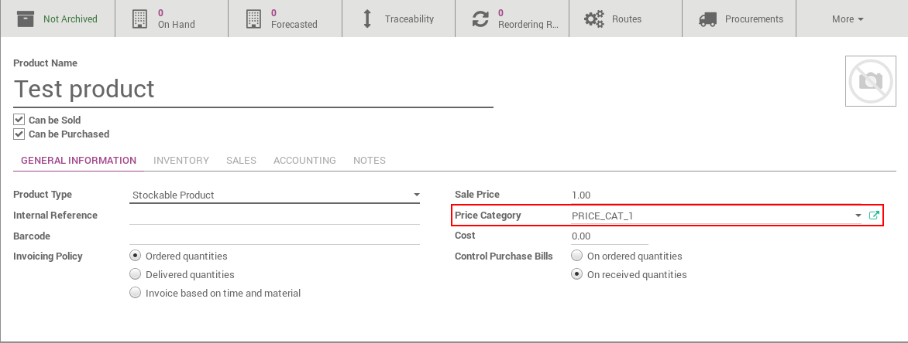

.. image:: https://img.shields.io/badge/licence-AGPL--3-blue.svg
   :target: http://www.gnu.org/licenses/agpl
   :alt: License: AGPL-3

======================
Product Price Category
======================

This module adds a field Price Category on Product Template
and allow Pricelist to be applied on this field.

Usage
=====

In Pricelist Form (Sales -> Configuration -> Pricelist), you can add or modify
an item ("Manage Pricelist Items" access should be checked in the user settings)
and select "Price Category" in "Applied on".
Then you have to choose on which price category should it be applied.

Product price category can be modified in product form -> General Information.

.. image:: https://odoo-community.org/website/image/ir.attachment/5784_f2813bd/datas
   :alt: Try me on Runbot
   :target: https://runbot.odoo-community.org/runbot/167/10.0

Bug Tracker
===========

Bugs are tracked on `GitHub Issues
<https://github.com/OCA/sale-workflow/issues>`_. In case of trouble, please
check there if your issue has already been reported. If you spotted it first,
help us smash it by providing detailed and welcomed feedback.

Credits
=======

Images
------

* Odoo Community Association: `Icon <https://github.com/OCA/maintainer-tools/blob/master/template/module/static/description/icon.svg>`_.

Contributors
------------

* Cyril Gaudin <cyril.gaudin@camptocamp.com>
* Akim Juillerat <akim.juillerat@camptocamp.com>

Do not contact contributors directly about support or help with technical issues.

Maintainer
----------

.. image:: https://odoo-community.org/logo.png
   :alt: Odoo Community Association
   :target: https://odoo-community.org

This module is maintained by the OCA.

OCA, or the Odoo Community Association, is a nonprofit organization whose
mission is to support the collaborative development of Odoo features and
promote its widespread use.

To contribute to this module, please visit https://odoo-community.org.
