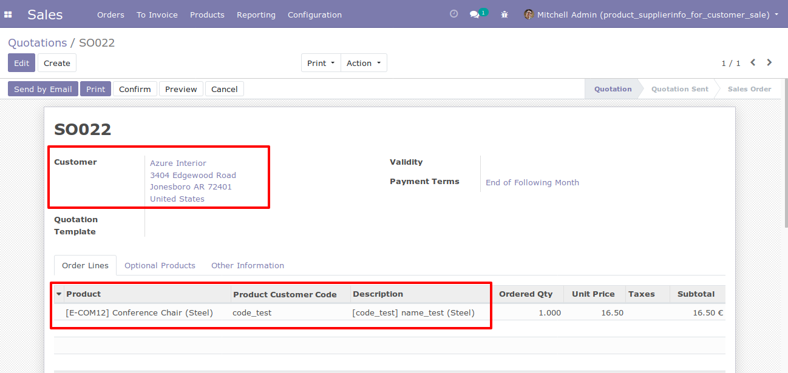
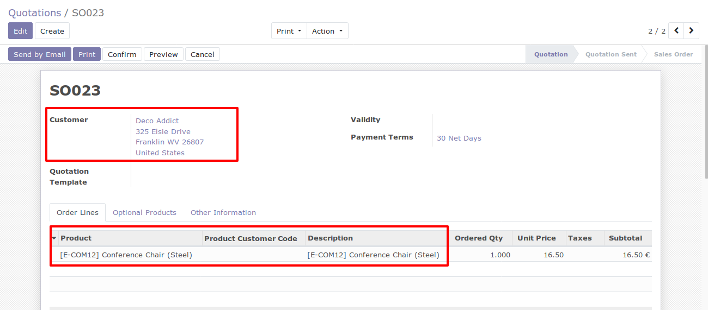

.. image:: https://img.shields.io/badge/license-AGPL--3-blue.png
   :target: https://www.gnu.org/licenses/agpl
   :alt: License: AGPL-3

======================================
Product Supplierinfo for customer sale
======================================

Based on product_supplierinfo_for_customer, this module loads in every sale order the
customer code defined in the product and allows
use the product codes and product name configured in each products in sale
orders.

To use this module, you need:

- Go to product and configure *Partner product name* and *Partner product code*
  for each selected customer.

.. figure:: static/description/configuration_customer.png
    :alt: Configure customer codes
    :width: 600 px

- When add order lines in sale quotation for a customer that has an specific
  name and code in the product, you can search that product with that customer
  name or code. Then, this values will be displayed in product description.

- If product does not have a configuration for customer selected, product will
  be search by its default code.

.. figure:: static/description/search_code_2.png
    :alt: Search by exist customer code
    :width: 600 px

Known issues
============

* Putting a minimum qty in a pricelist rule means the system will use the
  option 'list price' instead of any option you chose.

Bug Tracker
===========

Bugs are tracked on `GitHub Issues
<https://github.com/OCA/sale-workflow/issues>`_. In case of trouble, please
check there if your issue has already been reported. If you spotted it first,
help us smash it by providing detailed and welcomed feedback.

Usage
=====

.. image:: https://odoo-community.org/website/image/ir.attachment/5784_f2813bd/datas
   :alt: Try me on Runbot
   :target: https://runbot.odoo-community.org/runbot/95/10.0

Credits
=======

Images
------

* Odoo Community Association: `Icon <https://odoo-community.org/logo.png>`_.

Contributors
------------

* Nicola Malcontenti <nicola.malcontenti@agilebg.com>
* Serpent Consulting Services Pvt. Ltd. <support@serpentcs.com>

Maintainer
----------

.. image:: https://odoo-community.org/logo.png
   :alt: Odoo Community Association
   :target: https://odoo-community.org

This module is maintained by the OCA.

OCA, or the Odoo Community Association, is a nonprofit organization whose
mission is to support the collaborative development of Odoo features and
promote its widespread use.

To contribute to this module, please visit https://odoo-community.org.
