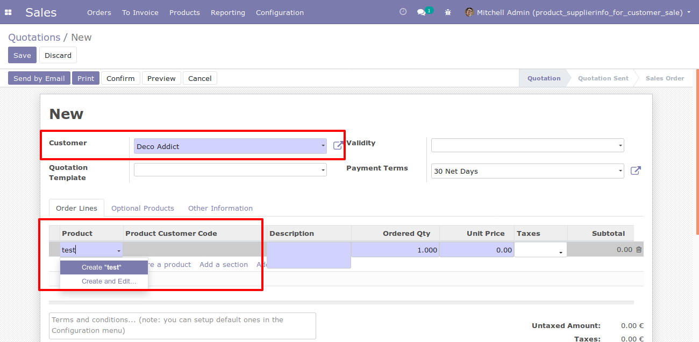

To use this module, you need:

- Go to product and configure *Partner product name* and *Partner
  product code* for each selected customer.

- When add order lines in sale quotation for a customer that has an
  specific name and code in the product, you can search that product
  with that customer name or code. Then, this values will be displayed
  in product description.

- If product does not have a configuration for customer selected,
  product will be search by its default code.

