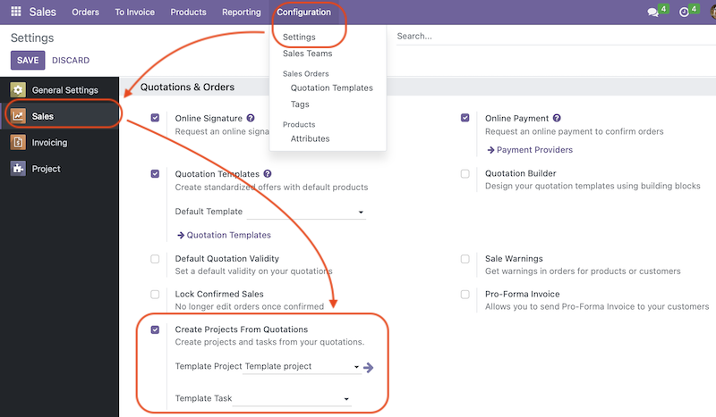

- Go to "Sales -> Settings" and scroll to the "Quotations & Orders" section
- Activate the "Create Projects From Quotation" checkbox
- Select a project to be used as a template in the "Template Project" field
- Optional: select a pre-defined task template in the "Template Task" field

NB: you can select from both active and archived projects/tasks in these fields.

