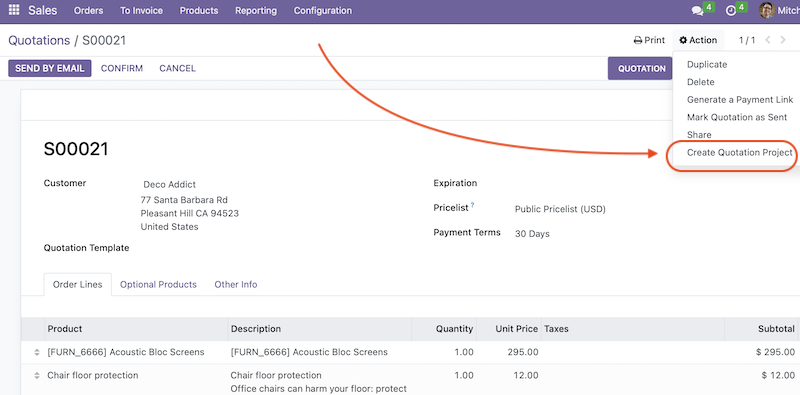

Open quotation and click the  "Create quotation project" from the "Action" menu.

A wizard will be shown with the following selection options:

- Create a project. Will create a new empty project.
- Create a project with task per line. Will create a new project and a task for each quotation  line.
- Create a project with task per product. Will create a new project and a task for each product of the quotation.

When creating tasks task template will be used. Task name will be replaced with a quotation line description. If the "tasks per product" option is used then task name will be populated from the first quotation line that contains that product.
If not task template is defined an empty task will be created with a name only.

If you want to create tasks only for some quotation lines you can remove the lines you don't need from the wizard line list.

New field "Quotation line" is added to Task. It's used to link tasks with quotations without breaking the standard Odoo flow. This allows to use task both during the quotation and sales order sales phases.

To access related projects from quotation you can use the existing "Projects" smart button on the quotation form.

