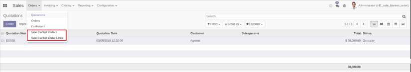
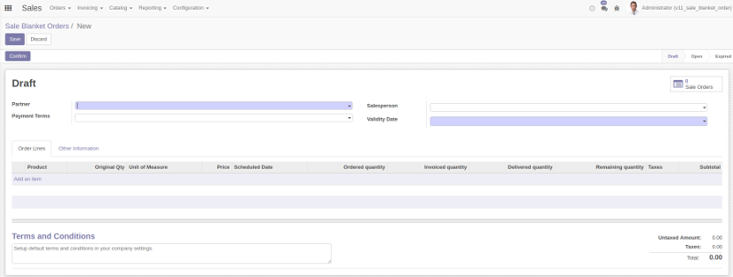
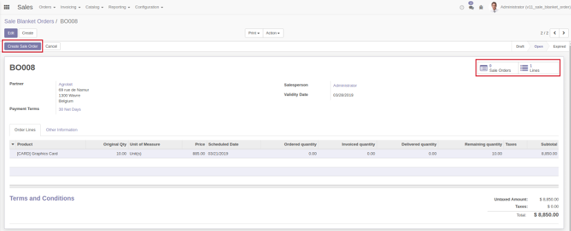
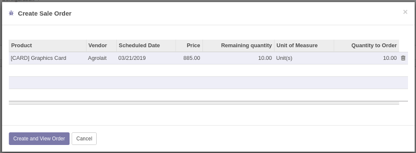
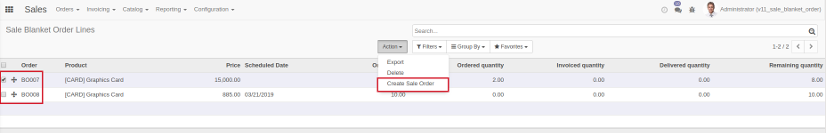
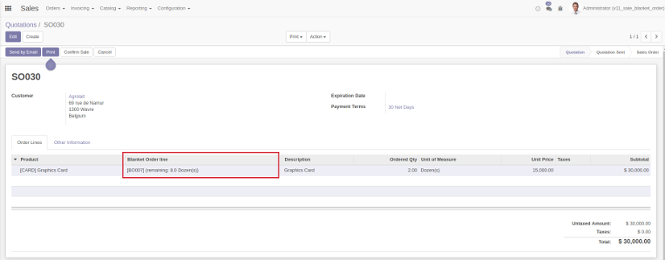

A new menu in the Sales area is created, allowing users to create new
blanket orders.

To create a new Sale Blanket Order go to the sale menu in the Sales
section:

Hitting the button create will open the form view in which we can
introduce the following information:

- Vendor

- Salesperson

- Payment Terms

- Validity date

- Order lines:  
  - Product
  - Accorded price
  - Original, Ordered, Invoiced, Received and Remaining quantities

- Terms and Conditions of the Blanket Order

From the form, once the Blanket Order has been confirmed and its state
is open, the user can create a Sale Order, check the Sale Orders
associated to the Blanket Order and/or see the Blanket Order lines
associated to the BO.

Hitting the button Create Sale Order will open a wizard that will ask
for the amount of each product in the BO lines for which the Sale Order
will be created.

Installing this module will add an additional menu which will show all
the blanket order lines currently defined in the system. From this list
the user can create customized Sale Orders selecting the lines for which
the PO (or POs if the customers are different) is (are) created.

In the Sale Order form one field is added in the PO lines, the Blanket
Order line field. This field keeps track to which Blanket Order line the
PO line is associated. Upon adding a new product in a newly created Sale
Order a blanket order line will be suggested depending on the following
factors:

- Closer Validity date
- Remaining quantity \> Quantity introduced in the Sale Order line

