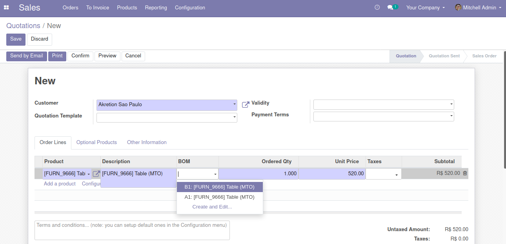
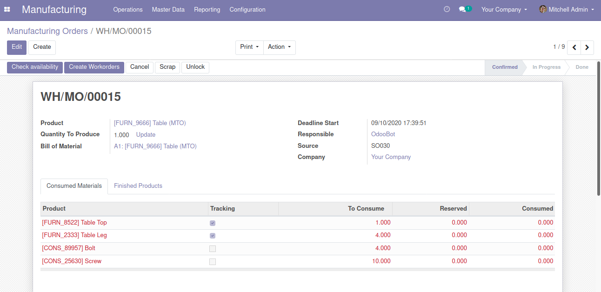

When adding a new sale order line, you can eventually select a specific Bill Of Materials.

When confirming the sale order, if the routing is manufacturing then the production order will be using the specified Bill Of Materials.

