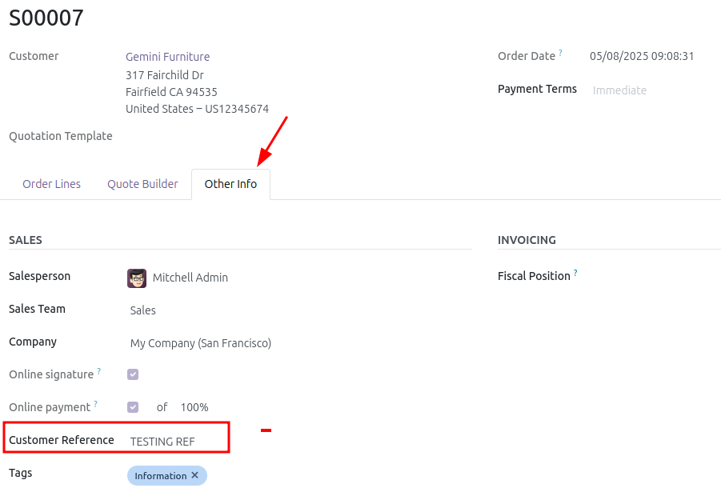
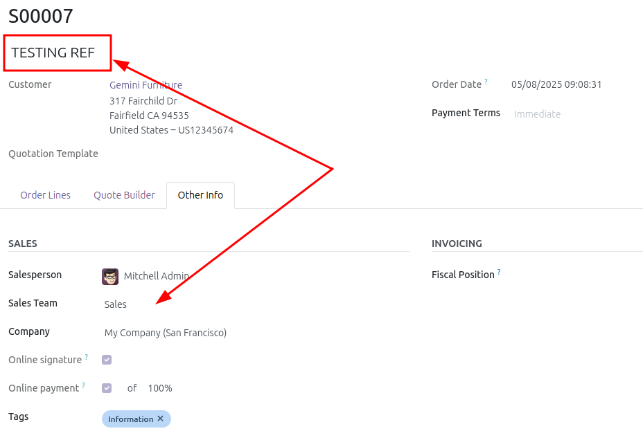
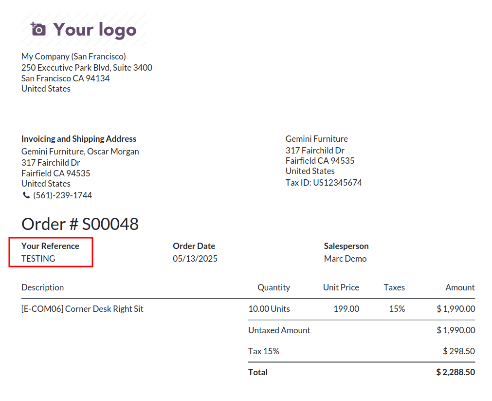
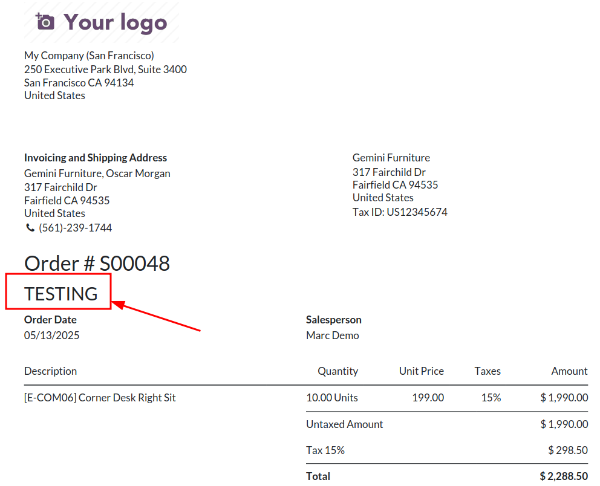

For a Sale Order, makes required client_order_ref field and reposition it,
for both form view and Sale reports.
Also makes this field searchable and add an optional column on both quotation and sale orders lists

## Sale Order Form View
### Before

### After

## Sale Report
### Before

### After

