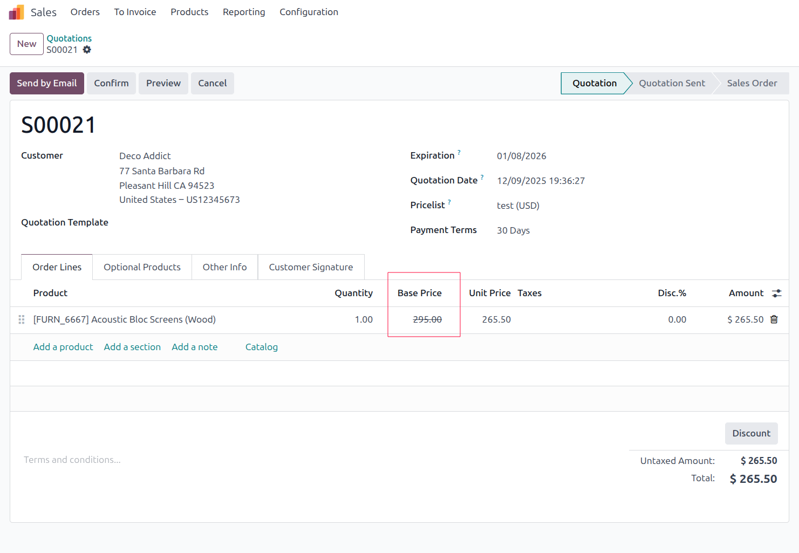

This module allows to display the original price before pricelist application.
This can be completed by the 'sale_report_crossed_out_original_price' module to
display crossed prices on sale order report.

In some cases, prices are based on several pricelists based on formulas and 
we want to display the base price in that case too. This beahaviour is 
configurable.

