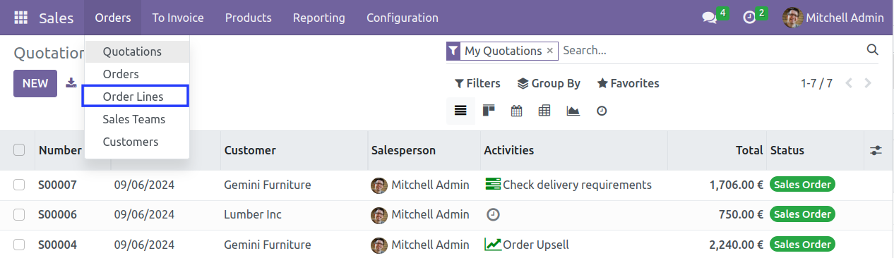
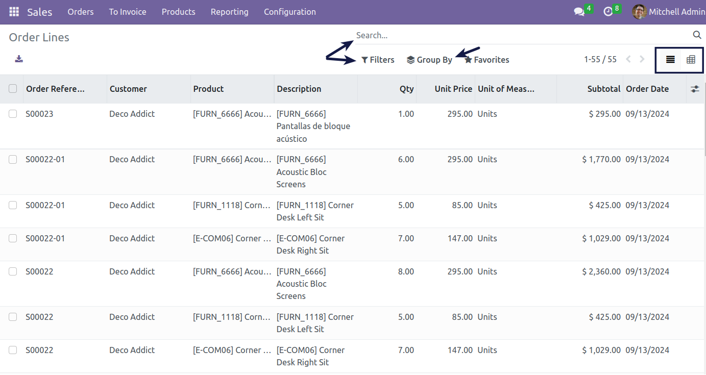

As a Sales User, I go to *Sales > Orders*.

I notice the new submenu ***Order Lines***.

From the available views (List and Pivot), I can search, filter and group the lines according to my needs.

