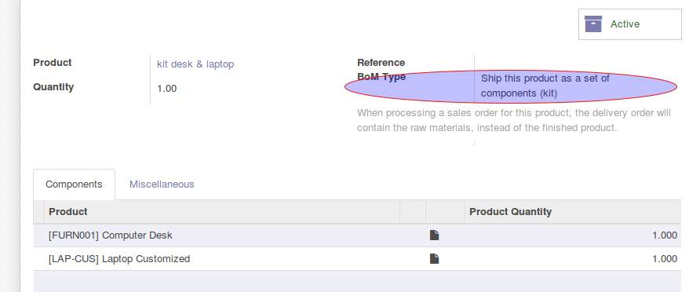
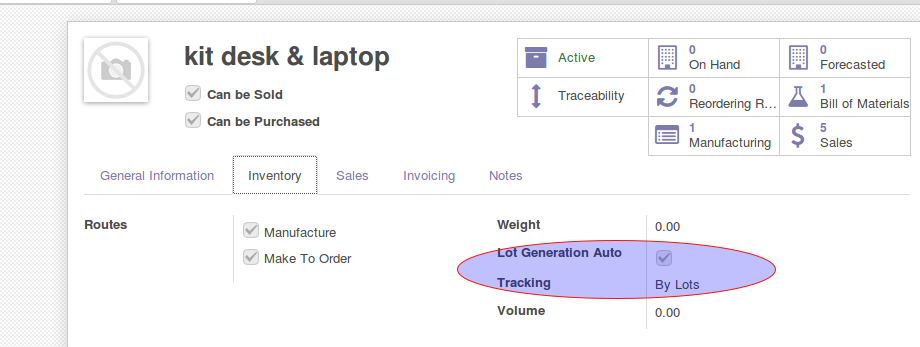
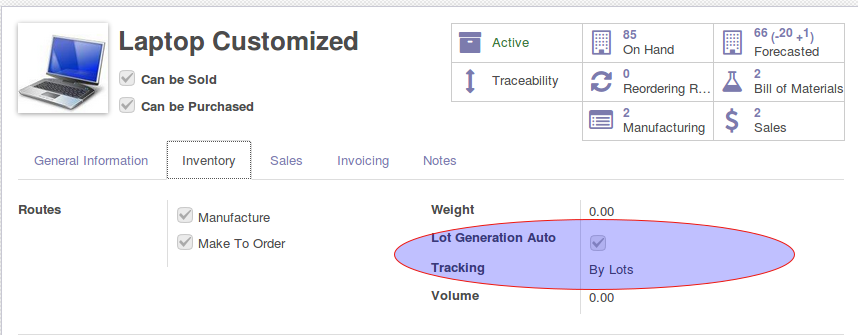
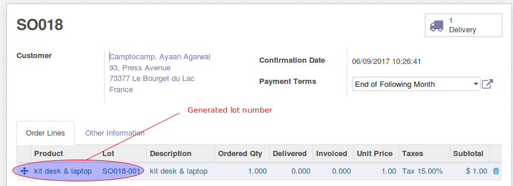
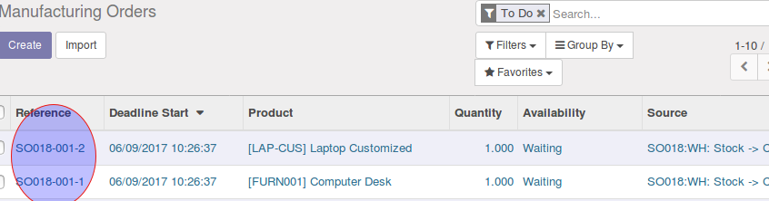
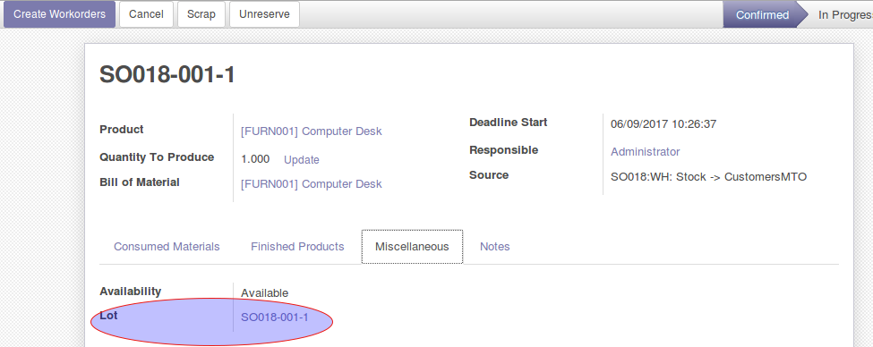
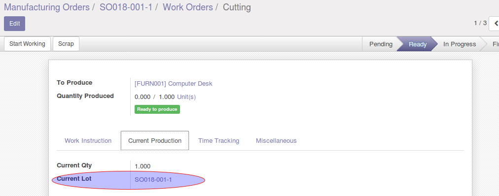
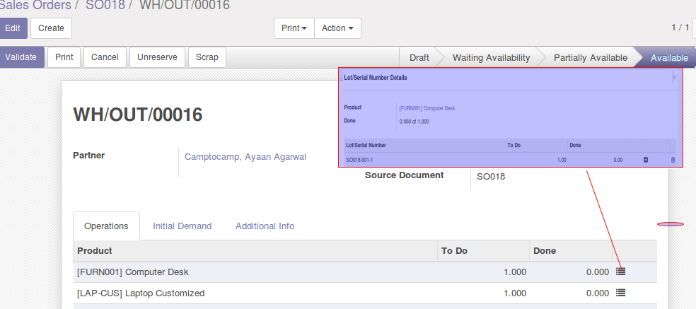

.. image:: https://img.shields.io/badge/licence-AGPL--3-blue.svg
   :target: http://www.gnu.org/licenses/agpl-3.0-standalone.html
   :alt: License: AGPL-3

==================
Sale Order Lot MRP
==================

Allow you to attach a lot in manufacturing order
that was defined by sale_order_lot_generator module
for all concerned products ("Lot Generation Auto" = True)
Name of the MO is also based on sale name.

Usage
=====

   #. First define a bom kit that is composed by components wich are tracked
by lot and have the option "Lot Generation Auto" = True.

|

|

.. image:: static/description/so_mrp_lot-3.png
    :width: 800 px
    :alt: Product Computer desk configuration

|

|

   #. Create a sale order with for the KIT desk & laptop and confirm it.
A lot number will be generated for this product.

|

|

   #. Manufacturing orders generated have with lot number

|

|

|

|

|

.. image:: https://odoo-community.org/website/image/ir.attachment/5784_f2813bd/datas
   :alt: Try me on Runbot
   :target: https://runbot.odoo-community.org/runbot/167/10.0

Bug Tracker
===========

Bugs are tracked on `GitHub Issues
<https://github.com/OCA/sale-workflow/issues>`_. In case of trouble, please
check there if your issue has already been reported. If you spotted it first,
help us smash it by providing detailed and welcomed feedback.

Images
------

* Odoo Community Association: `Icon <https://github.com/OCA/maintainer-tools/blob/master/template/module/static/description/icon.svg>`_.

Contributors
------------

* David BEAL <david.beal@akretion.com>
* Sébastien Beau <sebastien.beau@akretion.com>
* Valentin CHEMIERE <valentin.chemiere@akretion.com>
* Florian DA COSTA <florian.dacosta@akretion.com>
* Adrien CHAUSSENDE <adrien.chaussende@akretion.com>
* Mourad EL HADJ MIMOUNE <mourad.elhadj.mimoune@akretion.com> 

Maintainer
----------

.. image:: https://odoo-community.org/logo.png
   :alt: Odoo Community Association
   :target: https://odoo-community.org

This module is maintained by the OCA.

OCA, or the Odoo Community Association, is a nonprofit organization whose
mission is to support the collaborative development of Odoo features and
promote its widespread use.

To contribute to this module, please visit https://odoo-community.org.

