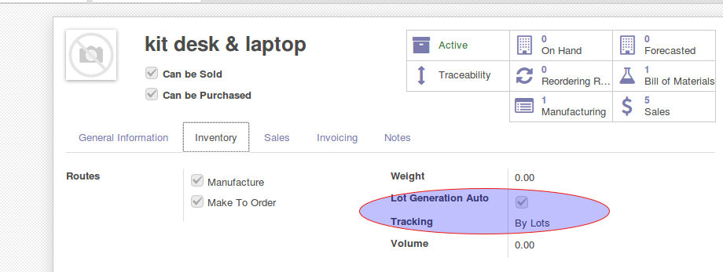
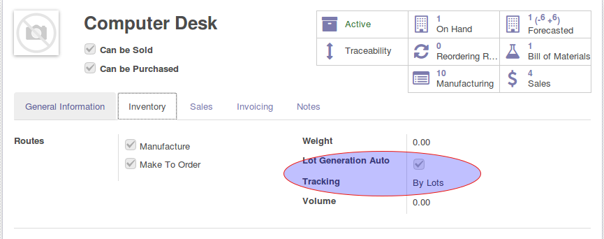
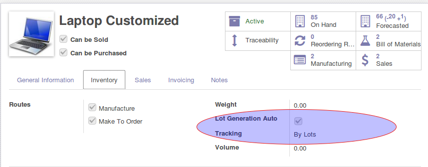
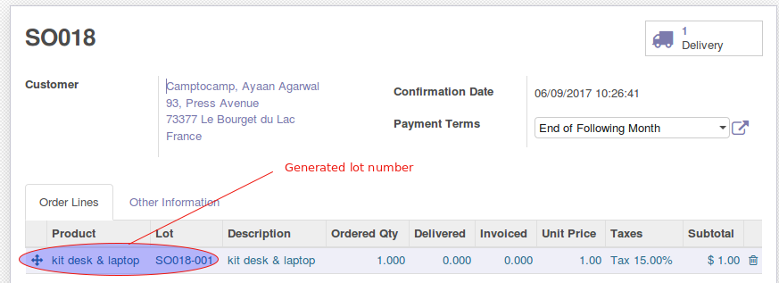

   #. First define a bom kit that is composed by components wich are tracked
      by lot and have the option "Auto Lot Generate" = True.

.. image:: ../static/description/so_mrp_lot-1.png
    :width: 800 px
    :alt: BOM KIT desk & laptop

|

|

|

|

   #. Create a sale order with for the KIT desk & laptop and confirm it.
      A lot number will be generated for this product.

|

|

   #. Manufacturing orders generated have with lot number

|

.. image:: ../static/description/so_mrp_lot-6.png
    :width: 800 px
    :alt: Manufacturing orders generated

|

.. image:: ../static/description/so_mrp_lot-7.png
    :width: 800 px
    :alt: Fisrt MO.

|

.. image:: ../static/description/so_mrp_lot-8.png
    :width: 800 px
    :alt: Second MO.

|

.. image:: ../static/description/so_mrp_lot-9.png
    :width: 800 px
    :alt: Stock Picking with lot generated.

