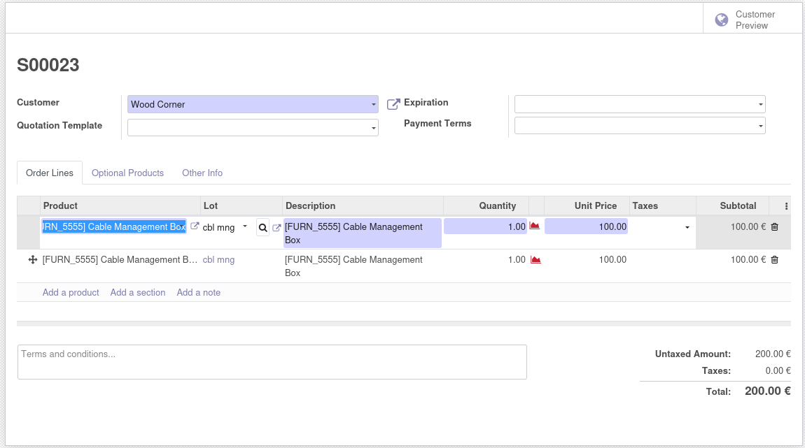

* Create a sales order and a sales order line.
* In edit mode, select a product for the sales order line, and a button should appear next to the "lot" field

* Click the button with the magnifiying glass
* Select one of the quants shown
  (only quants with a lot/serial number set are shown)

  .. figure:: ../static/description/img/quant_selection_popup.png
   :alt: The popup that lets the user select a quant.

* The lot is automatically filled based on the selected quant
