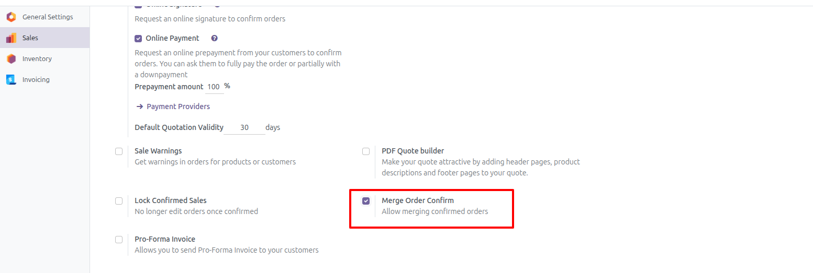
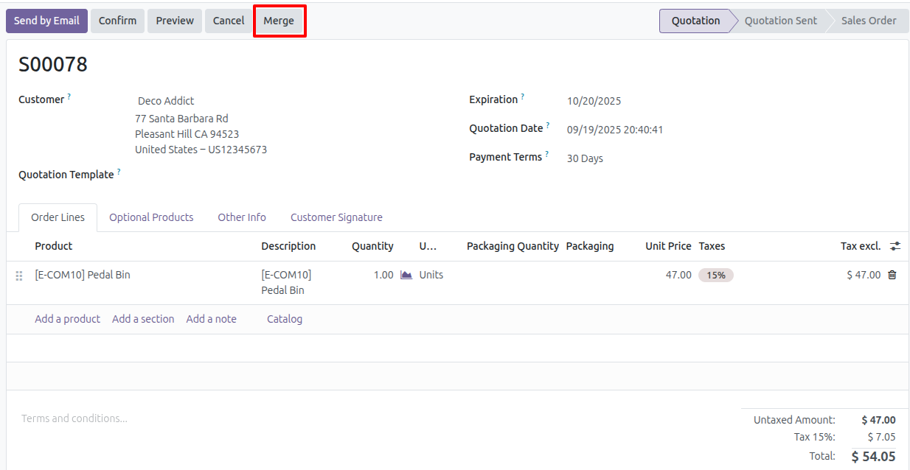
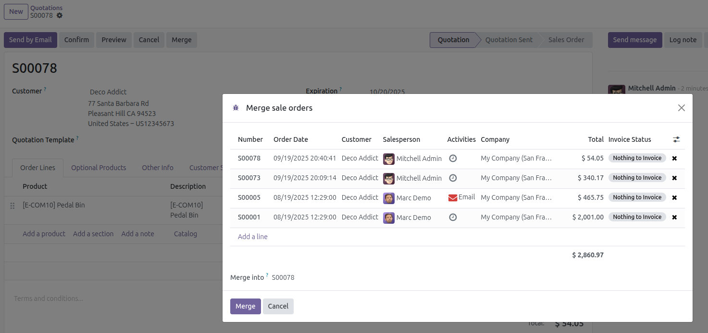
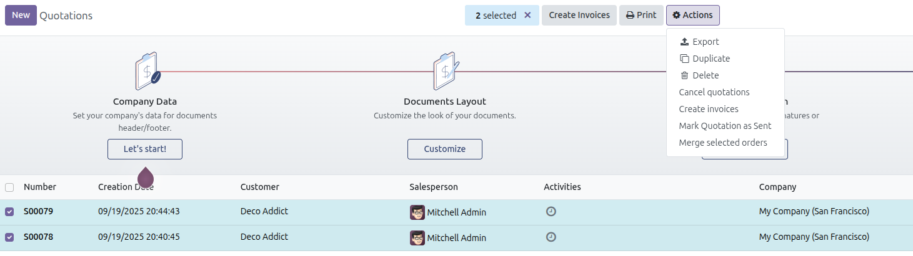
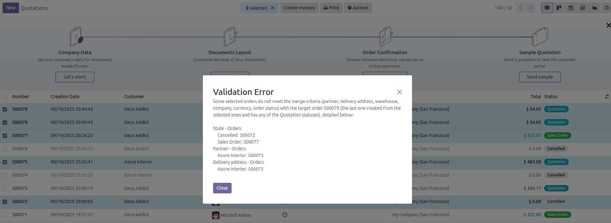

To use this module, you must go to the main sales order you want to merge with other sales orders. If there are any
candidates, you will see a "Merge" button in the header of the sales order form. Clicking this button will open a window
with all preselected mergeable sales orders. Delete the orders you do not want to merge and click the "Merge" button in
the footer of the pop-up window. The main window will update with the updated main sales order.

The merge criteria are defined as follows:
------------------------------

* Same customer, shipping address, warehouse, and company.
* Orders must be in "Draft" status.
* You can also merge confirmed orders if you enable the Merge Order Confirmation setting.
  

Merging from the form view
----------------------------------------------------------

1. Go to Sales
2. Create a new sales order and save
3. If there are any sales orders that match the merge criteria mentioned above, a Merge button will be enabled.

   

4. Pressing the Merge button displays a wizard in which you can select the target sales order and whether you want to
   remove it from those ready to be merged.

   

5. Press the Merge button to perform the merge. Keep in mind that this process will run all the validations performed in
   the normal workflow.

Merging from the tree view
--------------------------------------------------

1. Go to Sales
2. Select all the orders you want to merge and then select Merge selected orders from the actions menu.

   

3. If, when you press this menu, there are orders that do not meet the criteria, an exception will be thrown with the
   details so you can correct them.

   

4. Repeat steps 4 and 5 from the previous section.

The criteria can be easily extended in a custom module using the _get_merge_domain method of the sale.order model.
