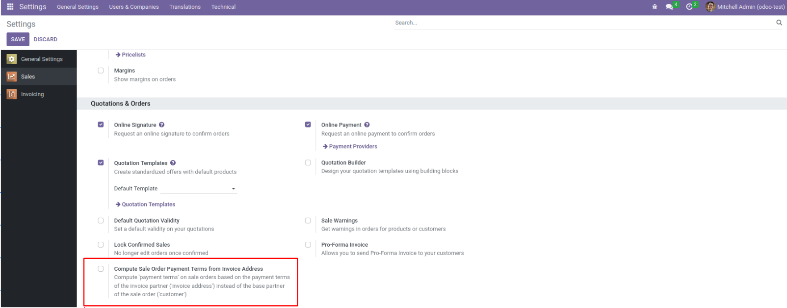
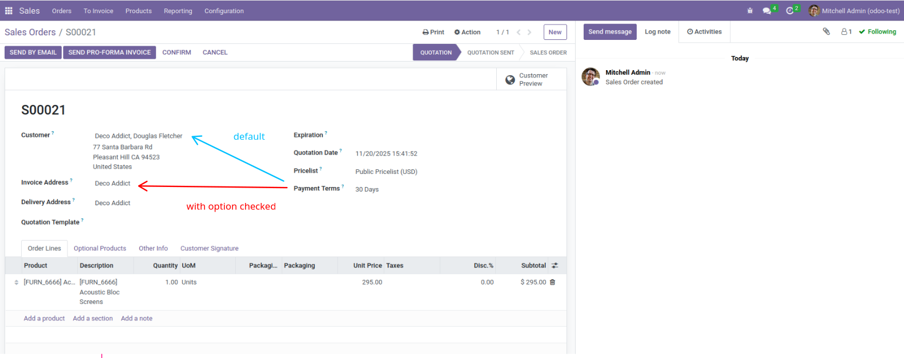

> This module does not impact the user interface.

To use this module, you need to:

- Go to Settings > Sales > Quotations & Orders

Check the setting "Compute Sale Order Payment Terms from Invoice Address"

- In Sale Orders, the "Payment Terms" field is now based on the "Invoice address" and not on "Customer"

