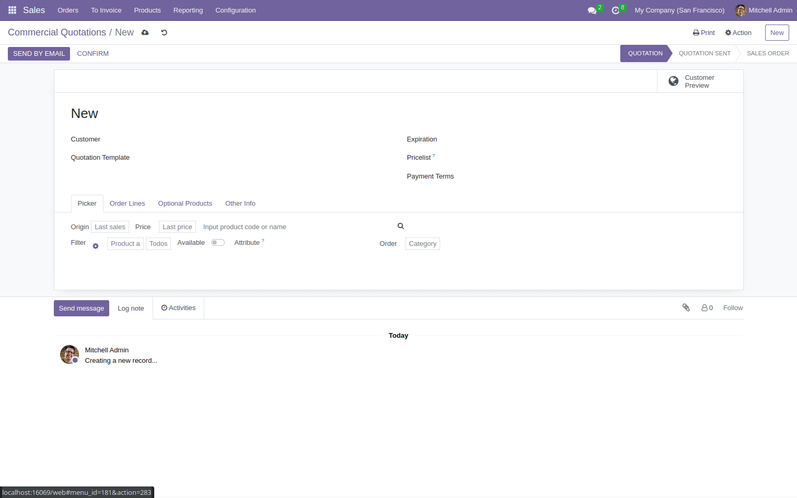

#. Go to *Sales > Orders > Salesman Quotations*

   * Create or edit an order.
   * On page Picker you can search for products.
   * You can:
      * Add a line by clicking on +1 button.
      * Add a packaging by clicking on +1 button.

        For this to work, product packagings must be enabled in settings, and
        the product must have at least one packaging configured for sales.

        Only the 1st one for sales will be used for the picker shortcut.
      * Add/edit/delete a line by clicking the kanban card.
      * Show image on fullscreen by clicking it.

On next gif you can see the options mentioned:

