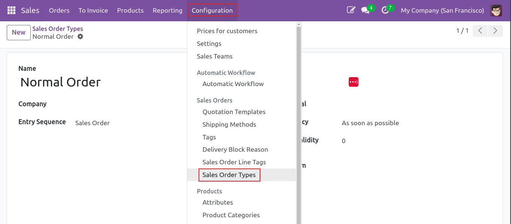
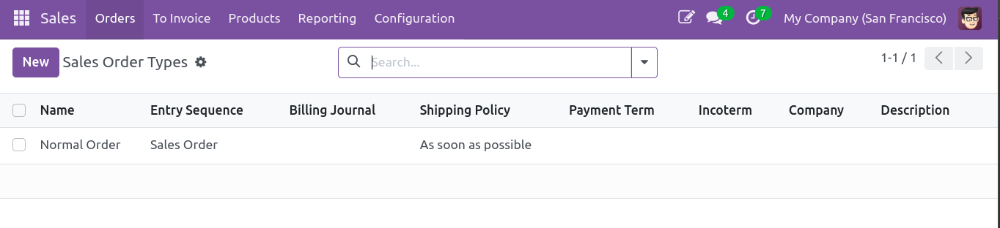
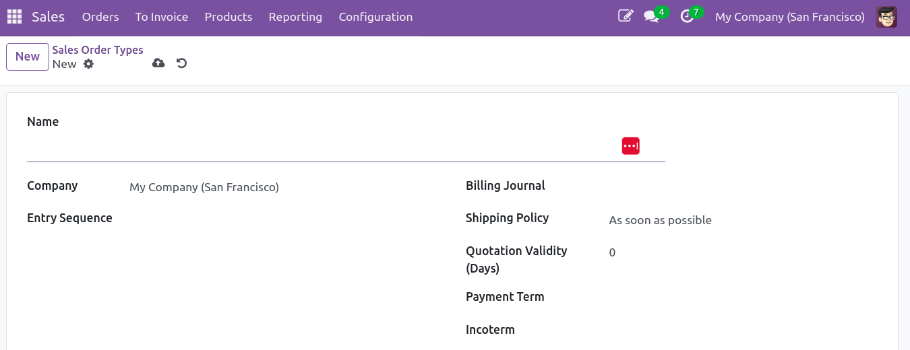

To configure Sale Order Types you need to:

1.  Go to **Sales \> Configuration \> Sales Orders Types**

2. The list of already existing "types" will be displayed

3. Create a new Sale Order type with all the settings you want using the available fields:

