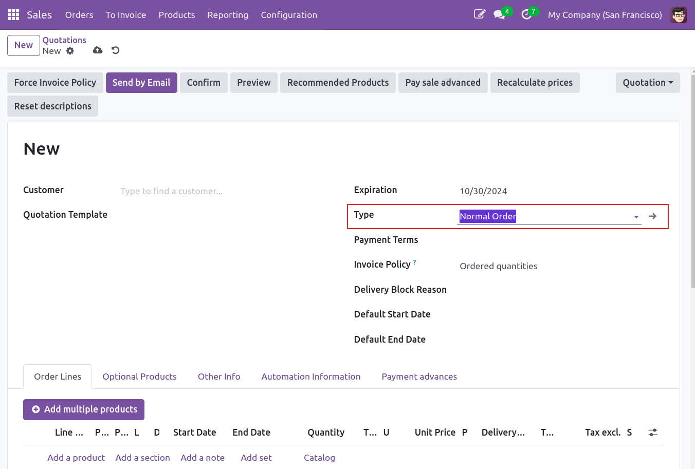
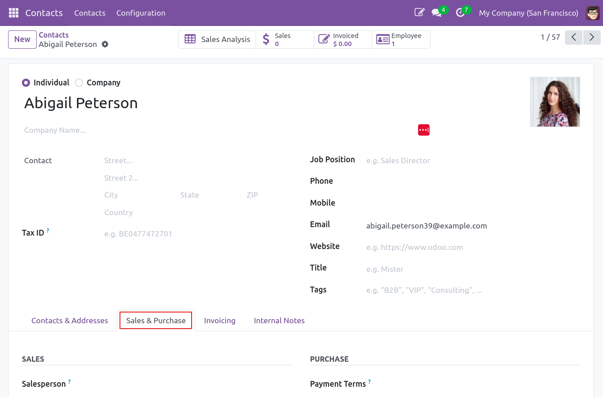
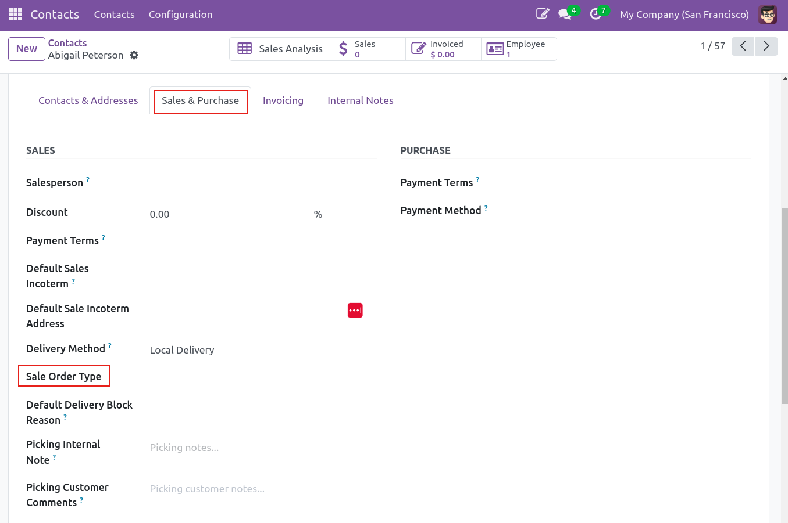

1.  Go to **Sales \> Sales Orders** and create a new sale order. Select
    the new type you have created before and all settings will be
    propagated.

2.  You can also define a type for a particular partner if you go to
    *Sales & Purchases* tab of the partner and set a sale order type:

Scroll down to find the "Sale order Type" field:
