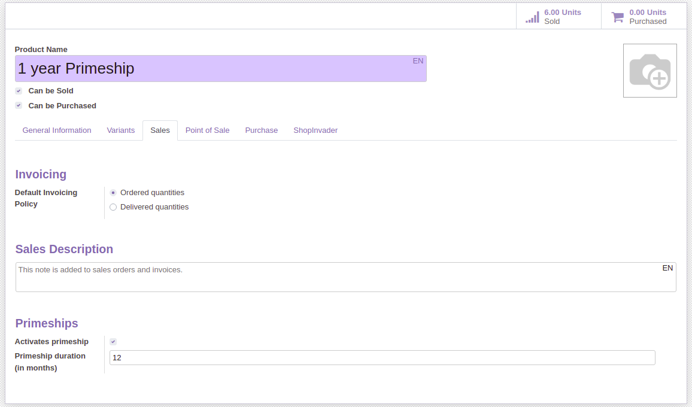
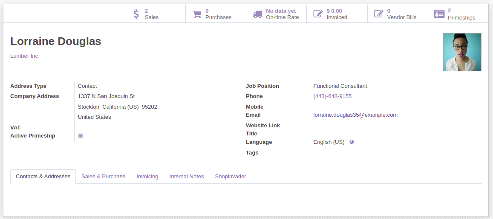
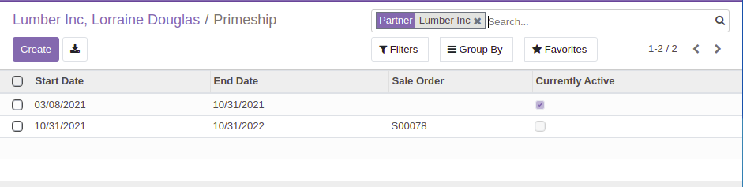

To make a product that activates primeship on sale order, you have to edit it, set its type to service and
go to the product form Sales tab and tick the Activates primeship checkbox:

You can then set a primeship duration.

You can see current primeship availability for a customer:

And a click on the widget will get you to the primeship list view for this customer:

