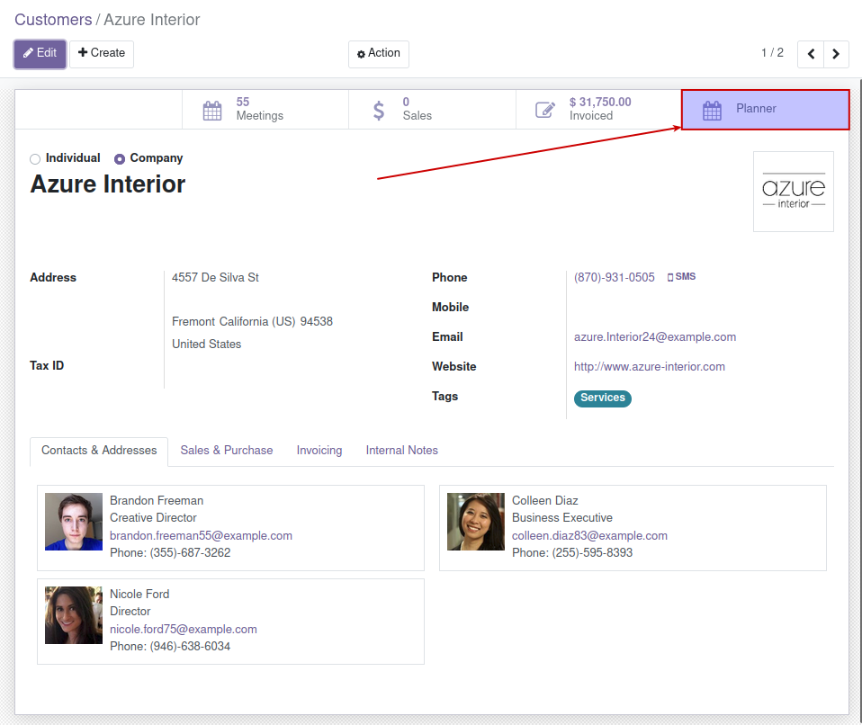
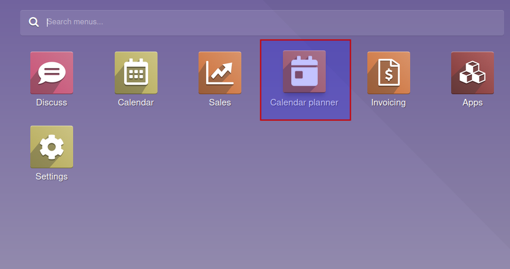

You can create now the recurrent events directly from the partners by
clicking next smart button:

By default the end of the recurrence is set by the settings field **Sale
Planner Forward Months**.

You can manage this new recurrent events from *Calendar planner* menu
entry.

On the first window, you will find a summary of the events that the user
has to do today.

By going to *Calendar planner \> Calendar events* you will have two
options:

1.  View the calendar events related to your user (*My Calendar*).
2.  View your base events related to the recurrences (*Recurrent
    calendar events*).

Finally on *Calendar planner \> Wizards* you will have again two
options:

1.  You can change the hour of the start of all the events related to a
    recurrency by using *Sale planner calendar wizard*.
2.  You can change the salesperson assigned to events related to a
    period of time by using the wizard *Reassignment of salesperson*.
