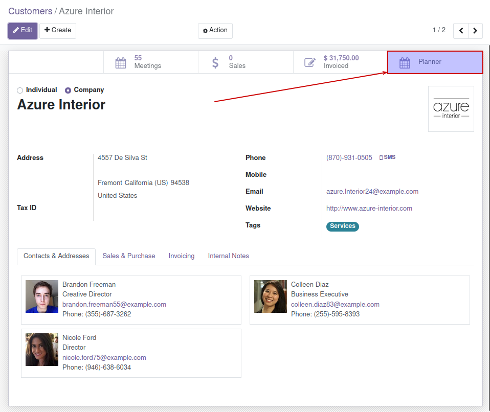
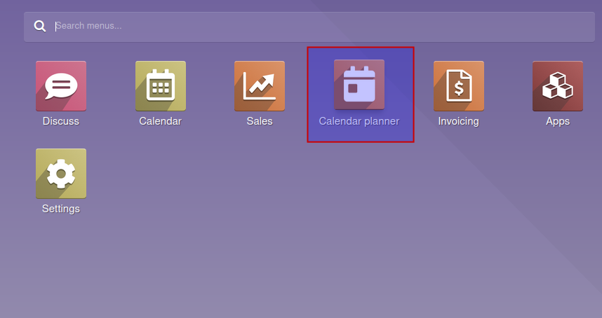

You can create now the recurrent events directly from the partners by clicking next
smart button:

By default the end of the recurrence is set by the settings field
**Sale Planner Forward Months**.

You can manage this new recurrent events from *Calendar planner* menu entry.

On the first window, you will find a summary of the events that the user has to do
today.

By going to *Calendar planner > Calendar events* you will have two options:

#. View the calendar events related to your user (*My Calendar*).

#. View your base events related to the recurrences (*Recurrent calendar events*).

Finally on *Calendar planner > Wizards* you will have again two options:

#. You can change the hour of the start of all the events related to a recurrency by using
   *Sale planner calendar wizard*.

#. You can change the salesperson assigned to events related to a period of time by using
   the wizard *Reassignment of salesperson*.
