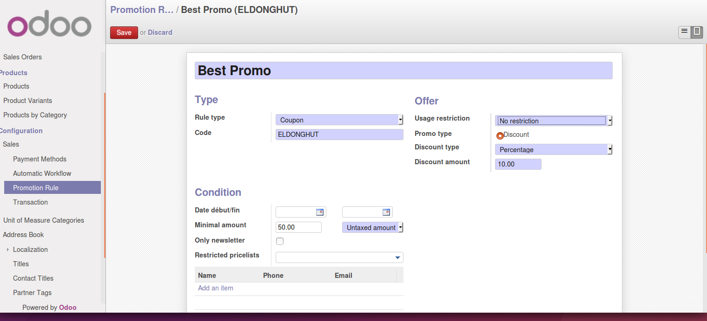

.. image:: https://img.shields.io/badge/licence-AGPL--3-blue.svg
   :target: http://www.gnu.org/licenses/agpl-3.0-standalone.html
   :alt: License: AGPL-3

===================
Sale Promotion Rule
===================

This module adds the concept of promotion rules that can be applied on the sale
order.

Two kinds of rules are implemented:
 * automatic
 * coupon

Automatic rules are applied/recomputed automatically for a sale order when the
user clicks on the button "Apply discount" in the view form. Depending on the
rule's criteria more than one automatic rule can be applied to a same sale
order.

Coupon are special manual rules. Only one coupon can be applied to a
sale order. This rule takes always precedence over automatic rules.

.. image:: sale_promotion_rule/static/description/promotion_rule.png
   :alt: .

Contributors
------------

* BEAU Sébastien <sebastien.beau@akretion.com>
* Benoît GUILLOT <benoit.guillot@akretion.com>

Roadmap
----------

* Add "automatic" rule that are automatically applied without coupon (only coupon have been implmented)
* Add gift support. (Only discount offer have been implemented)
* Add discount amount support
* Improve condition by using custom filter on partner
