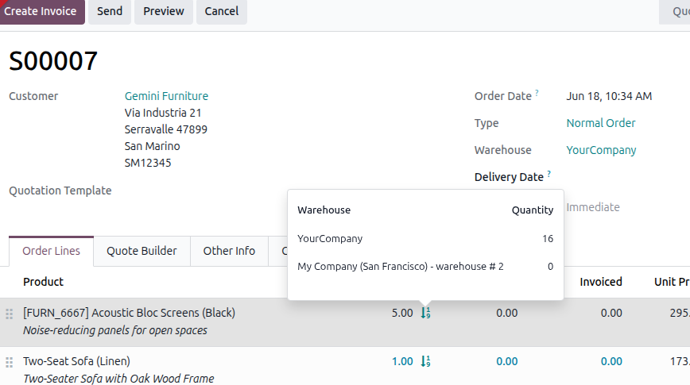

To use this module:

1. Go to Sales and create or open a quotation.
2. Add a storable product on an order line.
3. Click the quantity by warehouse icon next to the ordered quantity.
4. Review the available quantity displayed for each warehouse.

The icon is only displayed for storable products.

